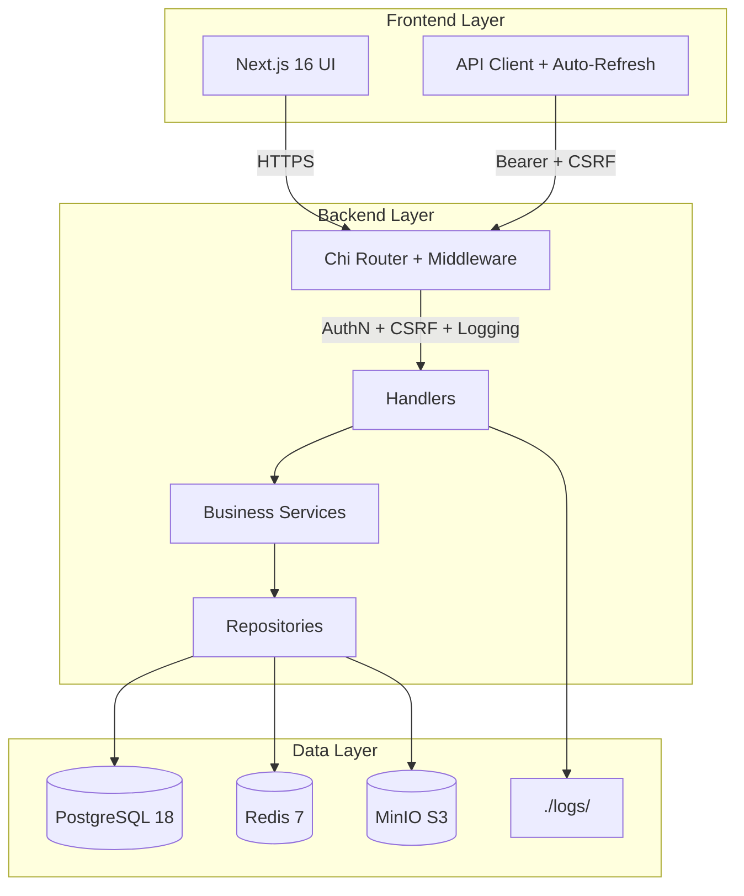
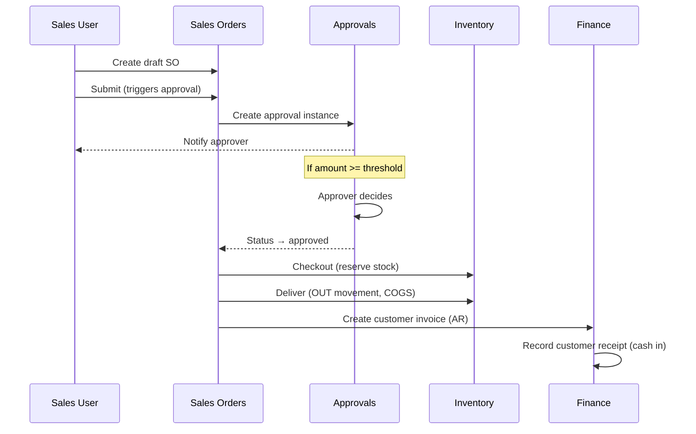

<div align="center">

#  StockKit

### Multi-tenant Business Operations Platform for Indonesian Companies

<p>
  
  
  
  
  
  
  
  
</p>

<p>
  <a href="#-quick-start">Quick Start</a> •
  <a href="#-features">Features</a> •
  <a href="#-architecture">Architecture</a> •
  <a href="docs/API.md">API Docs</a> •
  <a href="docs/FRONTEND.md">Frontend</a> •
  <a href="#-contributing">Contributing</a>
</p>

</div>

---

## 📖 Overview

**StockKit** is a production-grade, multi-tenant ERP-like platform built for Indonesian businesses — from UMKM to project-based enterprises. It covers the complete business cycle: **inventory → purchasing → sales → finance → reporting**, with built-in approval workflows, FX rate management, and a developer-focused observability suite.

> **Designed for:** Indonesian companies needing localized tax IDs (NPWP), IDR-first accounting, BPJS-ready payroll hooks, and regulatory-compliant audit trails.

---

## ✨ Features

### 🗂️ Core Modules

| Module | Description |
|--------|-------------|
| **📦 Inventory** | Multi-warehouse stock levels, FIFO/Average costing, adjustments, movements with full audit trail |
| **🛒 Purchasing** | Purchase requests → approval → PO → goods receipt → supplier invoice flow |
| **💰 Sales** | Sales orders → checkout (reserve) → deliver → invoice → receipt (cash flow) |
| **🏦 Finance** | Cash accounts, multi-currency payments, AR/AP aging, net working capital |
| **📊 Reports** | P&L, inventory valuation, AR/AP aging, digital signature on PDF export |
| **🌐 FX Rates** | Daily rate management with automatic document conversion |
| **✅ Approvals** | Multi-step approval workflows with threshold-based rules |
| **👥 Users & Roles** | 8 RBAC roles: `developer`, `owner`, `admin`, `finance`, `sales`, `purchasing`, `warehouse`, `auditor` |

### 🎨 UX Highlights

- **Theme-aware UI** — Light / Dark / System with design tokens
- **Signature Pad** — Canvas-based digital signature for PDF reports (localStorage reuse)
- **Matrix Rain** — Developer suite accent (role-gated)
- **Auto-refresh charts** — Real-time observability (5s interval, role-gated)
- **Mobile-ready** — Responsive sidebar with Ctrl+B collapse shortcut

### 🔒 Security & Compliance

- **AES-256-GCM encryption** for supplier bank accounts
- **JWT refresh token rotation** with reuse detection
- **CSRF protection** on all state-changing endpoints
- **Structured colored logs** with PII redaction (password, token, credit card)
- **Daily log rotation** (`.log` colored + `.jsonl` machine-readable)

---

## 🏗️ Architecture



### Tech Stack

| Layer | Technology | Purpose |
|-------|-----------|---------|
| **Frontend** | Next.js 16.3.6, React 19, TypeScript, Tailwind CSS, Recharts, Framer Motion | SPA, charts, animations |
| **Backend** | Go 1.27.1, Chi router, pgx v5, slog, golang-migrate | REST API, migrations, structured logging |
| **Database** | PostgreSQL 18.6 | OLTP, ACID transactions |
| **Cache** | Redis 7 | Sessions, rate limiting (graceful degradation) |
| **Storage** | MinIO (S3-compatible) | Product images, user avatars |
| **Infra** | Docker Compose | Local dev orchestration |

---

## 🚀 Quick Start

### Prerequisites

- Go 1.27.1+
- Node.js 20+
- Docker & Docker Compose
- Git

### Installation

```bash
# Clone
git clone https://github.com/neuralforgeio/StockKit.git
cd StockKit

# Environment
cp .env.example .env
# Edit .env — change all passwords for production

# Start infrastructure
docker compose up -d

# Backend
cd backend
go mod tidy
go run ./cmd/api migrate up
go run ./cmd/api seed          # seeds tenant, roles, developer user, initial data
go run ./cmd/api serve         # :8080
```

```bash
# Frontend (separate terminal)
cd frontend
npm install
npm run dev                    # :3000
```

### Default Credentials

| Email | Password | Role |
|-------|----------|------|
| `dearlyfebrianoi@gmail.com` | `dearlyfebriano08` | `developer` + `owner` |

### CLI Commands

```bash
go run ./cmd/api serve        # Start API server
go run ./cmd/api migrate up   # Run pending migrations
go run ./cmd/api migrate down # Rollback last migration
go run ./cmd/api migrate version  # Show current version
go run ./cmd/api seed         # Seed initial data (idempotent)
go run ./cmd/api version      # Show build info
```

---

## 📚 Documentation

| Document | Description |
|----------|-------------|
| [📘 API Reference](docs/API.md) | Complete REST API documentation with request/response examples |
| [🎨 Frontend Guide](docs/FRONTEND.md) | Page structure, routing, component patterns |
| [🏛️ Architecture](docs/ARCHITECTURE.md) | Deep-dive into modules, data flow, decisions |
| [🚢 Deployment](docs/DEPLOYMENT.md) | Production deployment & security hardening |
| [🔐 Security](docs/SECURITY.md) | Auth flow, encryption, redaction, CSRF |

---

## 🔄 Business Flow Example



---

## 📂 Project Structure

```
StockKit/
├── backend/
│   ├── cmd/api/              # Main entry point (serve, migrate, seed, version)
│   ├── internal/
│   │   ├── approval/         # Multi-step approval workflows
│   │   ├── auth/             # JWT, EdDSA signing, refresh rotation
│   │   ├── categories/       # Product categories (hierarchical)
│   │   ├── codes/            # Sequential number allocator
│   │   ├── config/           # Environment config
│   │   ├── crypto/           # AES-256-GCM field cipher
│   │   ├── customers/        # Customer master data
│   │   ├── dashboard/        # Aggregated KPIs
│   │   ├── devutil/          # OS disk usage (windows/unix)
│   │   ├── finance/          # Cash accounts, payments
│   │   ├── fx/               # FX rates
│   │   ├── httpapi/          # Router, handlers, middleware
│   │   ├── inventory/        # Stock levels, movements, COGS
│   │   ├── invoices/         # Supplier invoices, payments
│   │   ├── logging/          # Colored rotating structured logs
│   │   ├── notify/           # In-app notifications
│   │   ├── products/         # Product catalog
│   │   ├── purchasing/       # Purchase requests, PO, goods receipts
│   │   ├── sales/            # Sales orders, customer invoices, receipts
│   │   ├── store/            # pg pool, redis client
│   │   ├── suppliers/        # Supplier master (encrypted bank accounts)
│   │   ├── units/            # Product units
│   │   └── warehouses/       # Warehouse master
│   └── migrations/           # SQL migrations
├── frontend/
│   ├── app/                  # Next.js app router pages
│   ├── components/           # UI primitives + layout
│   └── lib/                  # API client, utils, export (PDF/Excel)
├── docs/                     # Documentation
├── infra/postgres/initdb/    # Database init scripts
└── docker-compose.yml        # Local dev orchestration
```

---

## 🎯 Roadmap

### ✅ Completed (M1-M6)

- [x] Platform foundation (API, auth, migrations)
- [x] Master data: products, categories, units, warehouses, customers, suppliers
- [x] Inventory: stock levels, movements, adjustments, FIFO/Average costing
- [x] Purchasing: requests → PO → goods receipt → supplier invoice
- [x] Sales: orders → checkout → deliver → invoice → receipt
- [x] Finance: cash accounts, payments, FX rates
- [x] Approvals: multi-step workflow with threshold rules
- [x] Reports: P&L, inventory valuation, AR/AP aging, PDF/Excel export
- [x] Developer suite: metrics, analytics, disk monitor, live logs
- [x] RBAC: sidebar gating for developer-only features

### 🚧 In Progress (M7)

- [ ] Approval decided hook (sync document status on approve/reject)
- [ ] Multi-currency auto-conversion on documents
- [ ] Goods receipts UI polish

### 📅 Planned (M8+)

- [ ] BPJS/Tax integrations
- [ ] Advanced forecasting (inventory demand)
- [ ] Mobile app (React Native)
- [ ] Webhook system for external integrations
- [ ] Audit log viewer (immutable, filterable)

---

## 🤝 Contributing

Contributions are welcome! Please:

1. Fork the repository
2. Create a feature branch (`git checkout -b feature/amazing-feature`)
3. Commit changes (`git commit -m "feat(module): description"`)
4. Push to branch (`git push origin feature/amazing-feature`)
5. Open a Pull Request

### Commit Convention

We follow [Conventional Commits](https://www.conventionalcommits.org/):

- `feat:` — new features
- `fix:` — bug fixes
- `docs:` — documentation only
- `refactor:` — code refactoring
- `perf:` — performance improvements
- `test:` — adding tests
- `chore:` — maintenance tasks

---

## 📄 License

This project is licensed under the **MIT License** — see the [LICENSE](LICENSE) file for details.

---

## 🙏 Acknowledgments

Built with ❤️ by [Neural Forge Labs](https://github.com/neuralforgeio) for Indonesian businesses.

Special thanks to:
- **Go community** — pgx, chi, golang-migrate
- **Next.js team** — App Router, Turbopack
- **Recharts** — beautiful, composable charts
- **Indonesian UMKM** — inspiration for localization

---

<div align="center">

**If you find StockKit useful, please ⭐ star the repository!**

[⬆ Back to top](#stockkit)

</div>
