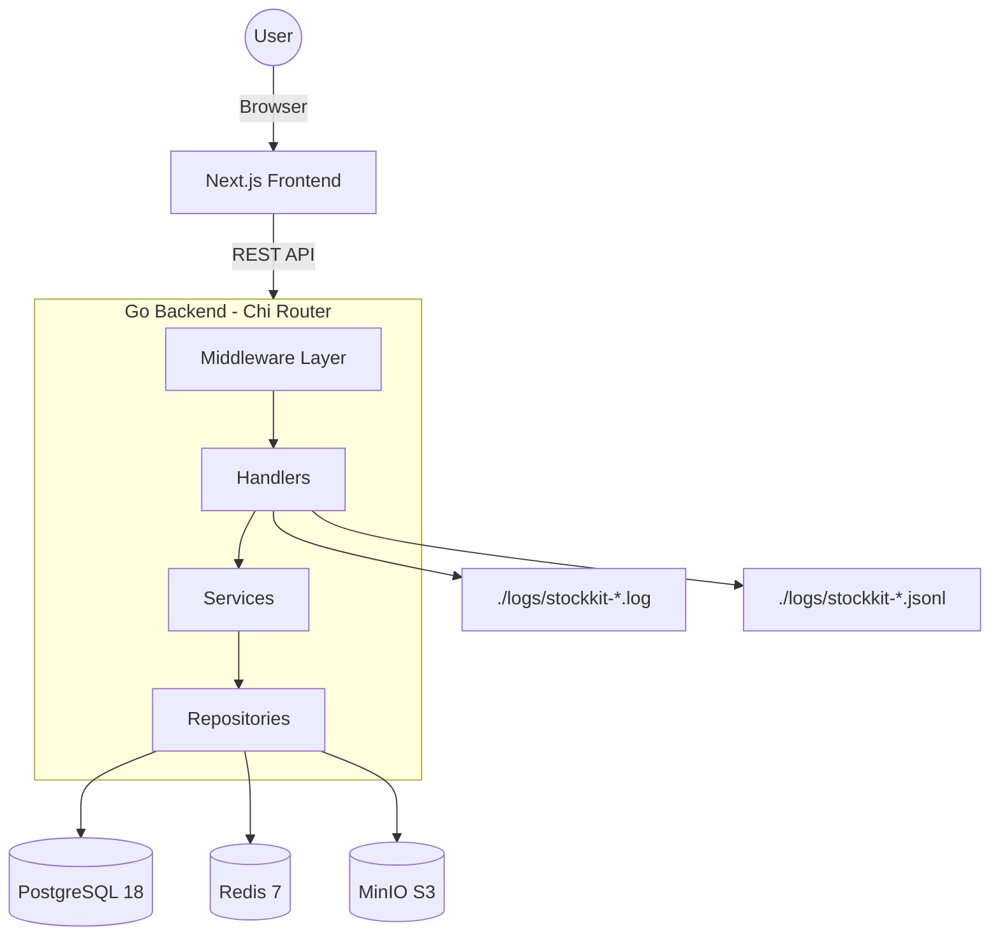
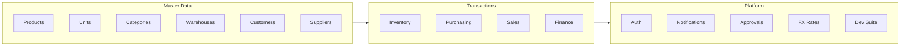
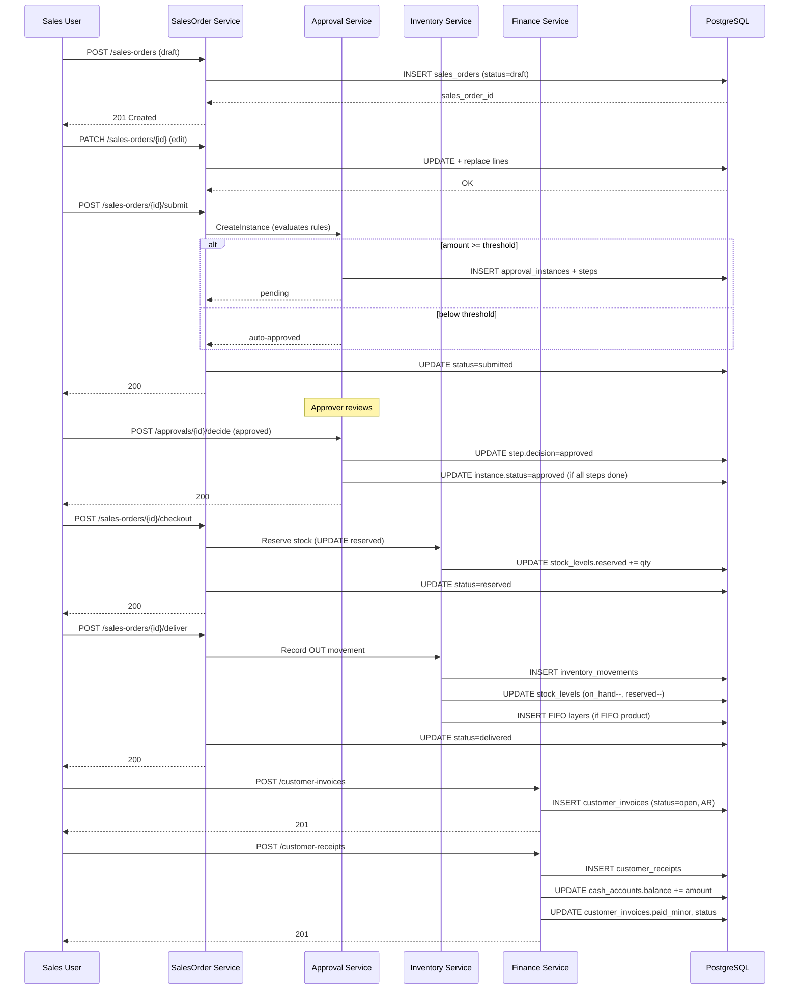
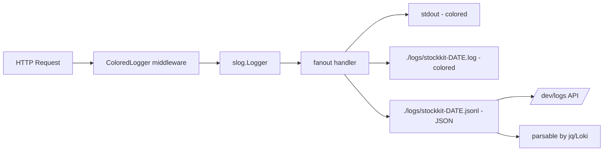
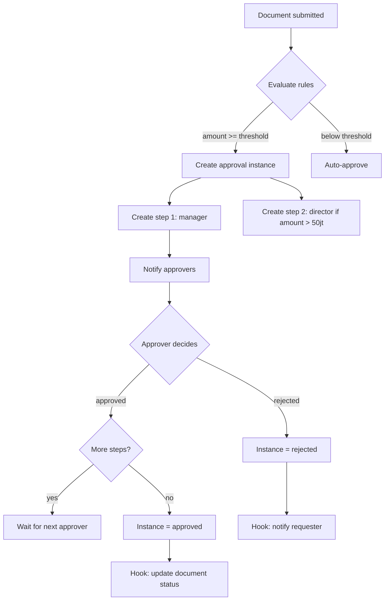
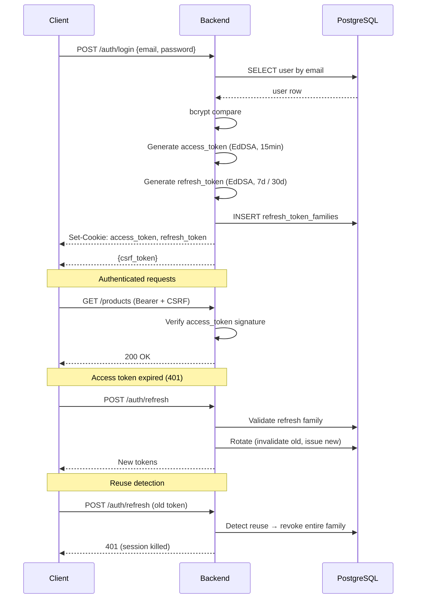

# 🏛️ StockKit Architecture

## System Overview



---

## Module Boundaries



---

## Data Flow: Sales Order Lifecycle



---

## Multi-Tenant Isolation

Every query includes `tenant_id` filter. The `auth.Claims` carries the tenant from JWT, propagated to every repository call.

```go
// Repository signature pattern
func (r *Repository) List(ctx context.Context, tenantID string) ([]Entity, error) {
    return r.pool.Query(ctx, `SELECT ... WHERE tenant_id = $1`, tenantID)
}
```

**Tenant boundaries:**
- Each tenant has its own sequence generators (`code_sequences`)
- Warehouse, customer, supplier, product IDs are unique per tenant
- User roles scoped per tenant (`user_roles`)
- Approval rules tenant-specific

---

## Costing Methods

### Average Costing (default)

```sql
-- On ADJ_IN or GR_IN
UPDATE stock_levels
SET on_hand = on_hand + qty,
    avg_cost_minor = (
        (on_hand * avg_cost_minor) + (qty * unit_cost)
    ) / (on_hand + qty)
WHERE product_id = $1 AND warehouse_id = $2
```

### FIFO Costing

Uses `inventory_cost_layers` table:
- Each IN movement creates a new layer (ordered by `movement_seq`)
- OUT movements consume layers in FIFO order (oldest first)
- `cogs_minor` on OUT = sum of consumed layer costs

---

## Logging Architecture



**Redaction:** `password`, `token`, `refresh_token`, `credit_card`, `secret`, `authorization`, `cookie`, `otp`, `pin` — all replaced with `[REDACTED]` before printing.

**Rotation:** New file daily at midnight. Old files preserved (manual `logrotate` recommended for production).

---

## Approval Workflow Engine



---

## Authentication Flow



---

## Database Schema Highlights

### Core Tables

- `tenants` — root of multi-tenancy
- `users`, `roles`, `user_roles` — RBAC
- `products`, `categories`, `units` — catalog
- `warehouses`, `stock_levels`, `inventory_movements`, `inventory_cost_layers` — inventory
- `sales_orders`, `sales_order_lines` — sales
- `customer_invoices`, `customer_receipts` — AR
- `purchase_requests`, `purchase_orders`, `goods_receipts`, `supplier_invoices`, `payments` — AP
- `approval_instances`, `approval_steps`, `approval_rules` — workflow
- `fx_rates` — currency
- `notifications` — in-app messaging
- `code_sequences` — auto-number allocators

### Indexes

All foreign keys indexed. Common queries (tenant_id + status, tenant_id + created_at) have composite indexes.

### Migrations

Managed by `golang-migrate`. Sequential files:
```
migrations/
├── 000001_init_platform.up.sql
├── 000001_init_platform.down.sql
├── 000002_inventory.up.sql
...
└── 000022_fx_rates.up.sql
```

---

## Frontend Architecture

```
frontend/app/
├── (auth)/
│   └── login/page.tsx
└── (app)/
    ├── layout.tsx          # Authenticated layout (sidebar + topbar)
    ├── page.tsx            # Dashboard
    ├── products/
    ├── inventory/
    ├── purchasing/
    ├── sales/
    ├── finance/
    │   ├── accounts/
    │   └── fx/
    ├── reports/
    ├── developer/
    └── settings/
```

### Component Patterns

- **`components/ui/`** — primitives (Button, Modal, KpiCard, Toast, etc.)
- **`components/layout/`** — Sidebar, Topbar, ProfileMenu
- **`lib/api/`** — typed API client modules
- **`lib/export/`** — PDF (jsPDF) + Excel (exceljs) exporters
